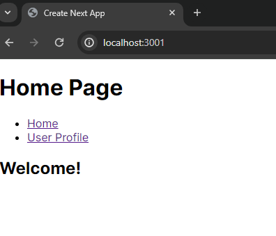
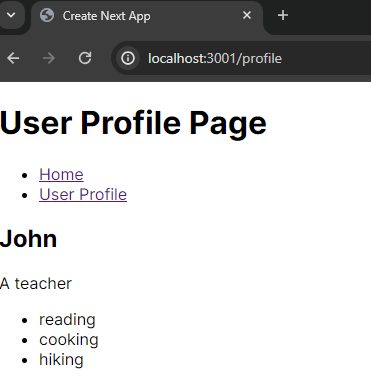

# Next.js User Profile

## Objective

This assignment is designed to reinforce your skills in creating dynamic user interfaces with React, utilizing conditional rendering, props, and client-side navigation with Next.js. Instead of replicating the demo code, you will apply these concepts in a new context. You will build a user profile page that dynamically displays user information and includes navigation to different sections of the profile.

## Features

- Home Page: Displays a simple welcome message.
- User Profile Page: Displays user's name, biography, and hobbies.
- Dynamic Rendering: Conditional rendering of user biography and hobbies list.
- Client-Side Navigation: Navigation between Home and Profile pages without page reloads.

## Pages

### Home



### User Profile



This is a [Next.js](https://nextjs.org/) project bootstrapped with [`create-next-app`](https://github.com/vercel/next.js/tree/canary/packages/create-next-app).

## Getting Started

First, run the development server:

```bash
npm run dev
# or
yarn dev
# or
pnpm dev
# or
bun dev
```

Open [http://localhost:3000](http://localhost:3000) with your browser to see the result.

You can start editing the page by modifying `app/page.js`. The page auto-updates as you edit the file.
